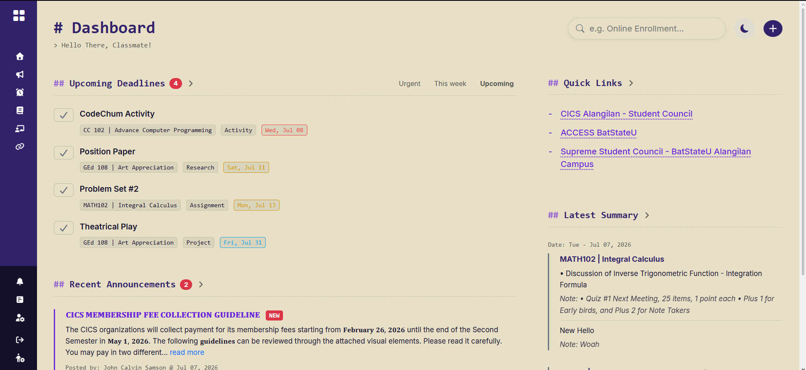
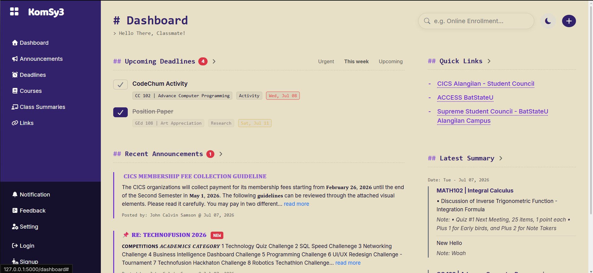

# KomSy3 (formerly BlockHub_Web) - UNDER DEVELOPMENT
A centralized class management system for CS 2103.

**Created By: John Calvin Samson**

## DOCUMENTATION
**Jul 7, 2026**
- Updated Dashboard Content to show newly added contents.
- Modified `model.py` & `webforms.py` to include properties for Announcement, ClassSummary, Course, Deadline, Link, and User.
- Drafted templates for adding entries (i.e Announcement, Course, Deadline, Link, Summary, Login, Signup)
- Enabled Login, Signup and Logout feature

**July 8, 2026**
- Modified Dashboard navigation redirection to individual pages.
- Enhanced UX through deadline task filters, responsive interaction tags (i.e. "new"), and
- Fixed duplicated cards of the same course in the Latest Summary Section.
- Updated sidebar navigation (i.e. made Site logo redirect to dashboard).
- Limited the visible content for Announcement, and refined UX through clickable titles.
- Created AnnouncementRead model for tagging unread announcements.

    
    

**July 9, 2026**
- Enabled routing for viewing individual announcement.
- Enabled Dark Mode for Dashboard Content.
- Fixed checkbox logic to properly remove task once clicked.
- Created Dropdown for creating entries
- Drafted Announcement Posting Page (has visual bugs)

**July 10, 2026**
- Fixed Announcement Posting Page visual bug.
- Changed mobile navbar design to put search, theme, and add button at the top.
- Organized css files for better styling accessibility.
- Created Summary, Deadline, and Course Form Page
- Drafted dedicated pages of each content

**July 11, 2026**
- Added overdue tag for deadline task 
- Added image upload feature using cloudinary, reaction button, and seen by count
- Fixed Announcements page and Enabled editing and deleting of post.
- Created URL pattern validator and constructed element validator for potential cross site scripting (XSS) attacks
- Enable image and file uploading
- Made it so the back button redirects back to previous page (based on site history)
- Separated modals into a single html file

**July 12, 2026** 
- Styled Deadlines Page
- Enabled Edit and Delete feature on Deadline Page

**July 13, 2026**
- Refined positioning of Deadline Page Cards
- Fixed deadline task checkbox interaction
- Added undo button for marking task as done

## TO-DO LIST
- [/] Avoid duplicates for Class Summary Sections.
- [ ] Add password security and form validation.
- [/] Limit content for Announcement.
- [/] Enable Dark Mode.
- [/] Enable dropdown for adding entry.
- [ ] Build Search Feature.
- [/] Construct Templates for entries.
- [/] Create route for individual viewing of announcement
- [/] Fix total deadline visual number
- [ ] Fix style and structure dedicated pages for each content (i.e. Announcement ✔️, Courses, Deadlines, Summaries)
- [ ] Create new model for Courses' schedule
- [/] Include total number of content and other labels on each dedicated pages
- [ ] Add small red dot on sidebar for pages with new content
- [ ] Fix Recent Announcements Total Count and refine Query 
- [ ] Have a live update on the total content count for each action on a page
- [ ] Fix mobile sidebar screen UI issue